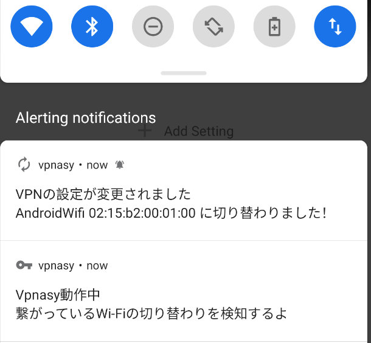

# AndroidアプリでWi-Fiの変化を検知する

私ごとですが [SecHack365](https://sechack365.nict.go.jp/) というイベントに参加しVpnasyというアプリを作成しました．
（詳細が書いてある [ポスター](https://sechack365.nict.go.jp/achievement/2020/img/2020_14_l.jpg) と [2020年の修了生の作品一覧](https://sechack365.nict.go.jp/achievement/2020/) ）

このアプリは繋がっているWi-Fi（家のWi-Fiなのか，外のFree Wi-Fiなのか等）によって自動で事前に設定した通りにVPNの設定を切り替えてくれるAndroidアプリです． Vpnasyの全体のコードはメンテ中のためまだ公開されていません．公開したら不味いところがないかの確認などを終わらせ次第公開します！

このアプリを作るにあたって接続しているWi-Fi（またはMobile Data）が切り替わったことを自動で認識しVPNを貼り直すという実装を行ったため，その方法をこれから説明します⭐️
因みにWi-Fiの種類はWi-Fiの`SSID`と`BSSID`を使い判断しています⚠️

では早速説明していきます．

## 最初に

今からの説明に書いているコードのうち`....`と書いている部分は`Wi-Fiの変化を検知する`の実装固有のものでないコードが入ります．
それらのコードを省略している為コードをコピペしただけではダメな場合があります．ご了承ください💦 

## 必要な権限の要求

まずはAndroidアプリ開発においてお馴染みの権限の要求からです！

Wi-FiのSSIDを取得するのに必要な権限は`ACCESS_NETWORK_STATE`と`ACCESS_FINE_LOCATION`と`ACCESS_WIFI_STATE` です．
Foreground Servicesを使うために必要な権限は`FOREGROUND_SERVICE`です．
SDKがAndroid Q以上の場合はForeground Servicesでの位置情報を有効にする必要があるので追加で`FOREGROUND_SERVICE`が必要になります．

これらの権限を要求してきましょう．

### 権限の要求方法と実際のコード
`AndroidManifest.xml`に以下を追加します．

```xml
    <uses-permission android:name="android.permission.ACCESS_FINE_LOCATION" />
    <uses-permission android:name="android.permission.ACCESS_BACKGROUND_LOCATION" />
    <uses-permission android:name="android.permission.ACCESS_NETWORK_STATE" />
    <uses-permission android:name="android.permission.ACCESS_WIFI_STATE" />
    <!--  SDK VersionがQ以上の端末用  -->
    <uses-permission android:name="android.permission.FOREGROUND_SERVICE" />
```

次に任意のActivity等でユーザーに権限をリクエストするダイアログを出すためのコードを書きます．`RequestMultiplePermissions`を使う方法が綺麗でいいと思います．

⚠️リクエストが拒否されたときの実装の説明はここでは省くため，`TODO`と書いてます⚠️

```kotlin
....
class PermissionRequestActivity : AppCompatActivity() {
....
     private fun requestPermission(){
        val requiredPermissions = when {
            Build.VERSION.SDK_INT >= Build.VERSION_CODES.Q -> arrayOf(
                Manifest.permission.ACCESS_FINE_LOCATION,
                Manifest.permission.ACCESS_BACKGROUND_LOCATION
            )
            else -> arrayOf(Manifest.permission.ACCESS_FINE_LOCATION)
        }
        requestPermissionLauncher.launch(requiredPermissions)
    }
    
    private val requestPermissionLauncher = registerForActivityResult(
        ActivityResultContracts.RequestMultiplePermissions()
    ) {
        if (Build.VERSION.SDK_INT >= Build.VERSION_CODES.Q && it[Manifest.permission.ACCESS_BACKGROUND_LOCATION] != true) {
            // TODO:Request Permission Again.
            return@registerForActivityResult
        }
        if (it[Manifest.permission.ACCESS_FINE_LOCATION] != true) {
            // TODO:Request Permission Again.
            return@registerForActivityResult
        }
        // Success.
    }
....
}
```

次は，本題のWi-Fiの変化を検知していきましょう！

## Wi-Fiの変化を検知

`ConnectivityManager`を使います．

`TransportType`に`TRANSPORT_WIFI`と`TRANSPORT_CELLULAR`を設定したRequest（コード上での`networkRequest`）を生成します． 不必要なTypeは設定しないほうがいいです．

次に`registerNetworkCallback`で`networkCallback`をセットすることでMobile Dataへの切り替わりも含むWi-Fiの切り替わりが行われる度にnetworkCallbackが呼ばれることになります．

コードは以下のようになります⭐️

```kotlin

val connectivityManager = getSystemService(Context.CONNECTIVITY_SERVICE) as ConnectivityManager

val networkRequest = NetworkRequest.Builder()
        .addTransportType(NetworkCapabilities.TRANSPORT_WIFI)
        .addTransportType(NetworkCapabilities.TRANSPORT_CELLULAR)
        .build()

val networkCallback: ConnectivityManager.NetworkCallback =
    object : ConnectivityManager.NetworkCallback() {
        override fun onAvailable(network: Network) {
            super.onAvailable(network)
            val wifiManager = getSystemService(Context.WIFI_SERVICE) as WifiManager
            if (wifiManager.isWifiEnabled) {
                val ssidText = wifiManager.connectionInfo.ssid.let {
                    // *${SSID}* になっているから．
                   it.substring(1, it.length - 1)
                }
                val bssidText = wifiManager.connectionInfo.bssid
　　　　　　　　　 // ここではTimberを使ってログを表示させていますが適宜好きに書き換えてください．
                Timber.d("Connected SSID: ${ssidText}, BSSID: ${bssidText}")
            } else {
                Timber.d("Connected Mobile Data")
            }
        }
    }

// Callbackをセットする
connectivityManager.registerNetworkCallback(networkRequest, networkCallback)

```

上のコードを検知したい間ずっと生き続けてくれる`Activity`やら`Service`やらに書きます．自分はアプリが別のアプリの下に行っても動いて欲しかったので`Foreground Service`に書きました 🌵

## 動作確認

（実機で行うと個人情報が流出するため）エミュレーターで実行した結果

```
2021-03-xx xx:xx:xx.xxx ..../com.hunachi.vpnasy D/ObserveNetworkStateService$networkCallback: Connected SSID: AndroidWifi, BSSID: 02:15:b2:00:01:00
```

うまくいってますね🍒

位置情報の認証等で失敗していると，SSIDは`<unknown ssid>`にBSSIDは`02:00:00:00:00:00`になります．
ここで証明することはできませんが，他のアプリを起動させていてもアプリが終了されない限り正常にWi-Fiの変化を検知し続けてくれます．

Vpnasyで通知を表示させている時の様子もせっかくなので公開します！




## 最後に

ここまで読んでくださりありがとうございました💞
誰かのお役に立てれば幸いです💞
間違え，改善案等ありましたら [Hunachi](https://twitter.com/_hunachi) までDMかリプライよろしくお願いいたします🙇‍♀️💦

## 参考にしたサイト
https://developer.android.com/reference/android/net/wifi/WifiInfo

https://developer.android.com/reference/android/net/ConnectivityManager.NetworkCallback


